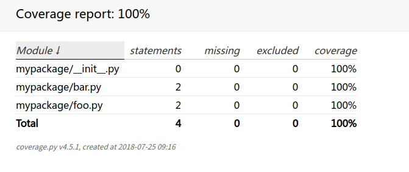

# pytest 常规使用

目录结构[cookbook/python/test_pytest](https://github.com/lossme/cookbook/code/test_pytest)


```sh
mypackage
├── __init__.py
├── foo.py
└── bar.py
tests
├── __init__.py
├── test_bar.py
└── test_foo.py
```

```python
# mypackage/foo.py
def foo():
    return 'foo'

# mypackage/foo.py
def bar():
    return 'bar'
```


```python
# tests/test_foo.py
from mypackage.foo import foo

def test_foo():
    rv = foo()
    assert rv == 'foo', '返回值不等于foo rv={}'.format(rv)


# tests/test_bar.py
from mypackage.bar import bar

def test_bar():
    rv = bar()
    assert rv == 'bar', '返回值不等于bar rv={}'.format(rv)
```


```sh
# 运行tests文件夹下的所有测试（会自动收集以test开头的文件和test开头的方法，并进行测试）
# -s 捕获标准输出，这样才能看到 print 输出的内容， -v 输出更多的信息
>>> pytest tests -s - v
============================= test session starts ==============================
platform linux -- Python 3.6.4, pytest-3.3.1, py-1.5.2, pluggy-0.6.0 -- /home/key/anaconda3/bin/python
cachedir: .cache
rootdir: /home/key/git/cookbook/python/test_pytest, inifile:
plugins: cov-2.5.1
collected 2 items

tests/test_bar.py::test_bar PASSED                                       [ 50%]
tests/test_foo.py::test_foo PASSED                                       [100%]

=========================== 2 passed in 0.01 seconds ===========================
```

```
# 只运行这个tests/test_bar.py测试文件
>>> pytest tests/test_bar.py -s -v

# 只运行 tests/test_bar.py里的test_bar方法
>>> pytest tests/test_bar.py::test_bar -s -v

# 只测匹配的
>>> pytest tests/test_bar.py -k test_bar -s -v
```


## 测试覆盖率

```sh
pytest --cov=mypackage --cov-report=html -v -s tests
```

会生成一份报告`htmlcov`: 
